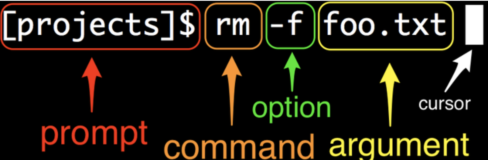

# The web developer roadmap.
This is a list of skills to get a job as a developer.

## 1. Required Learning for Any Path
## Command Line
The command line is how you run your code. You must be able to navigate and execute the required commands. The better you are on the command line, the more efficient you will be as a developer.
### Prompt
Every command line starts with some symbol or symbols designed to “prompt” you to action. The prompt usually ends with a dollar sign $, and is preceded by information that depends on the details of your system.

| Command | Description | Example |
| ------- | ----------- | ------- |
| echo <string> | Print string to screen | $ echo hello |
| man <command> | Display manual page for command | $ man echo |
| pwd | Display the path of the current directory user are in. | 
